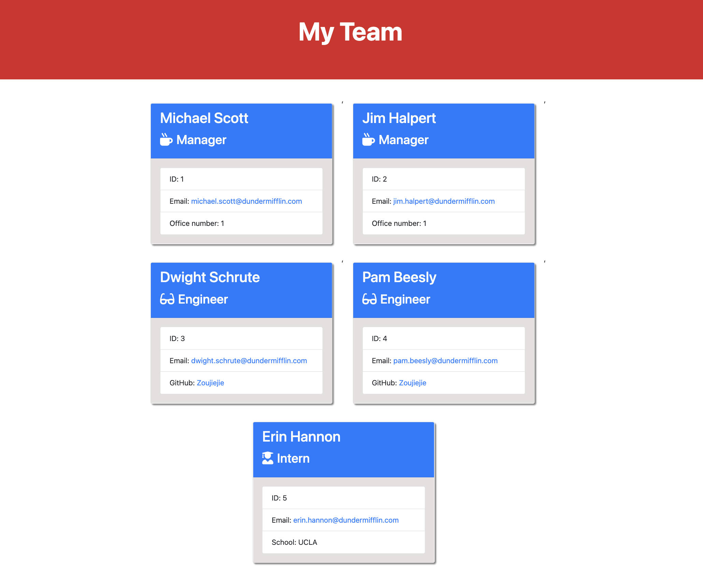

# Team-Profile-Generator

## Description & Instructions
When the user enters node index.js in the integerated terminal, the application starts running and gives the user a series of prompted questions. When the user input all of their answers, the application will automatically generate an index.html document with all the input answer data. Base on the prompt questions, this application is a team profile generator to help the user to create theri own team webpage with the team members info listed


## User Story
```md
AS A manager
I WANT to generate a webpage that displays my team's basic info
SO THAT I have quick access to their emails and GitHub profiles
```

## Acceptance Criteria
```md
GIVEN a command-line application that accepts user input
WHEN I am prompted for my team members and their information
THEN an HTML file is generated that displays a nicely formatted team roster based on user input
WHEN I click on an email address in the HTML
THEN my default email program opens and populates the TO field of the email with the address
WHEN I click on the GitHub username
THEN that GitHub profile opens in a new tab
WHEN I start the application
THEN I am prompted to enter the team manager’s name, employee ID, email address, and office number
WHEN I enter the team manager’s name, employee ID, email address, and office number
THEN I am presented with a menu with the option to add an engineer or an intern or to finish building my team
WHEN I select the engineer option
THEN I am prompted to enter the engineer’s name, ID, email, and GitHub username, and I am taken back to the menu
WHEN I select the intern option
THEN I am prompted to enter the intern’s name, ID, email, and school, and I am taken back to the menu
WHEN I decide to finish building my team
THEN I exit the application, and the HTML is generated
```

## Websites
- GitHub Repo: https://github.com/Zoujiejie/team-profile-generator
- Demo Video: https://drive.google.com/file/d/1p5GDa9DceSNQ7XLUIhhKwy54yDsz6ysw/view 

## Screenshot
This is a screenshot of the generated HTML webpage.


